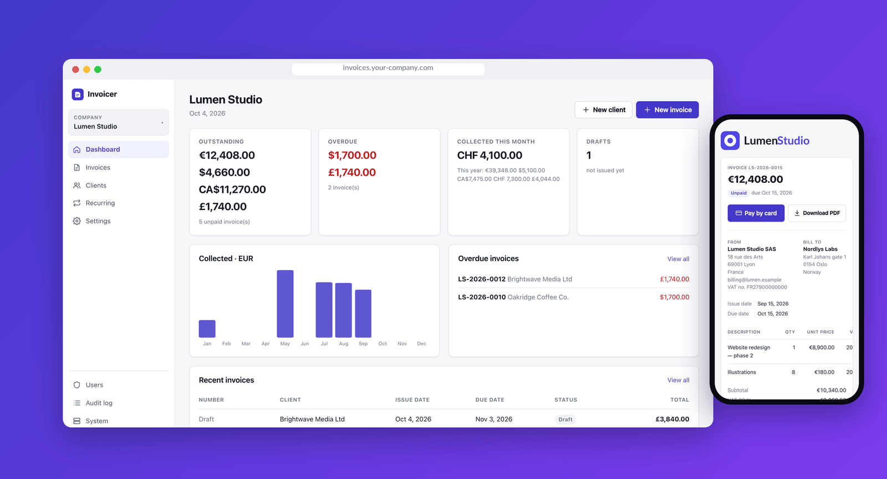
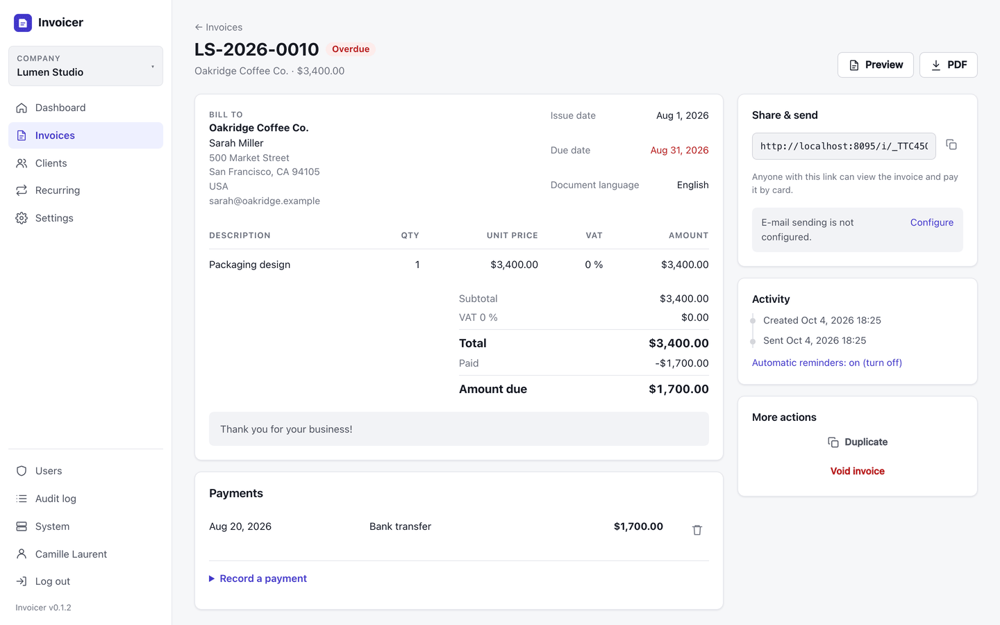
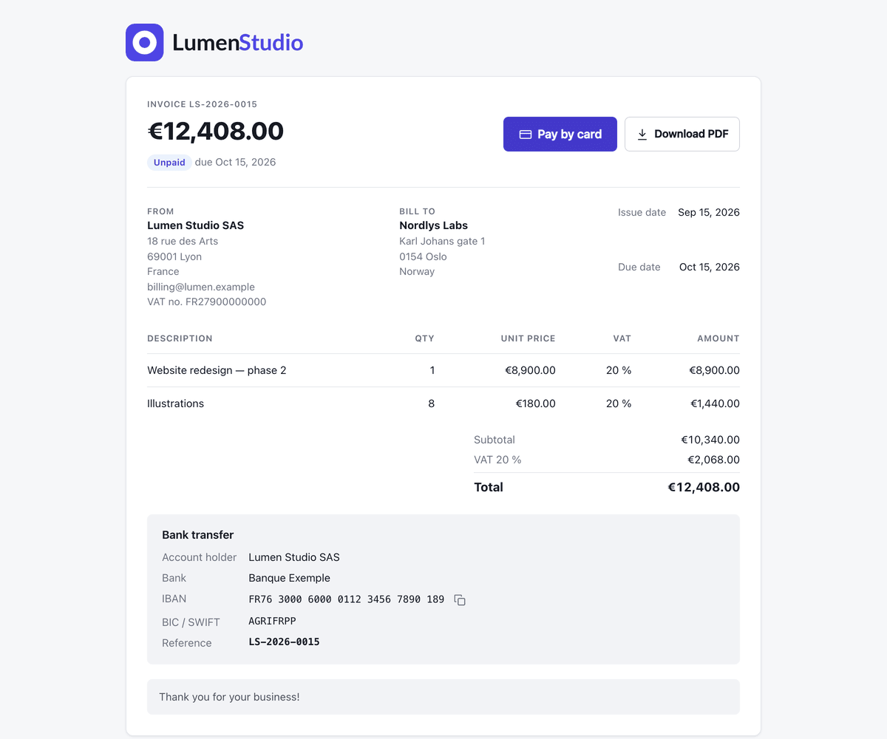
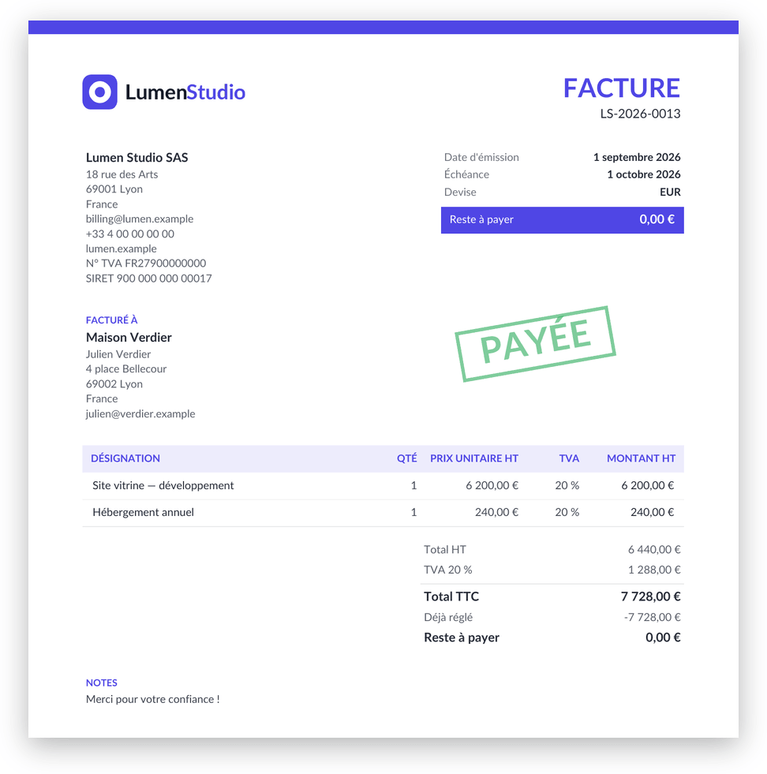
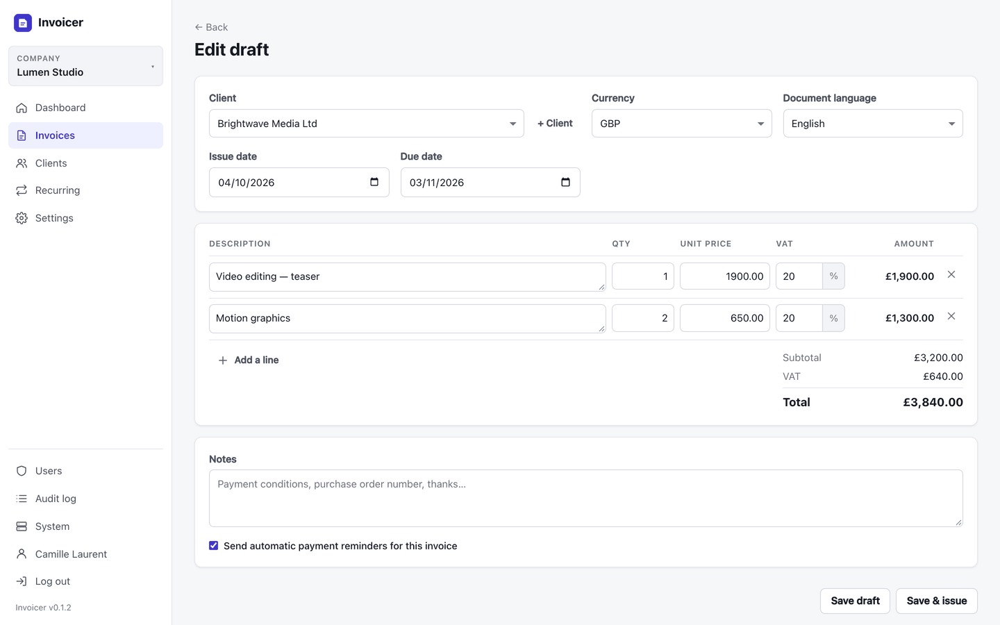
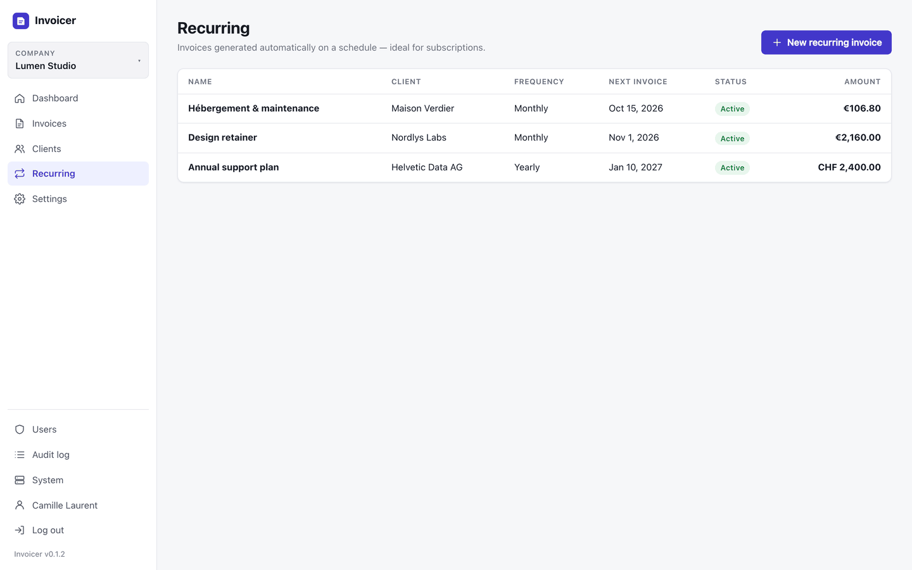
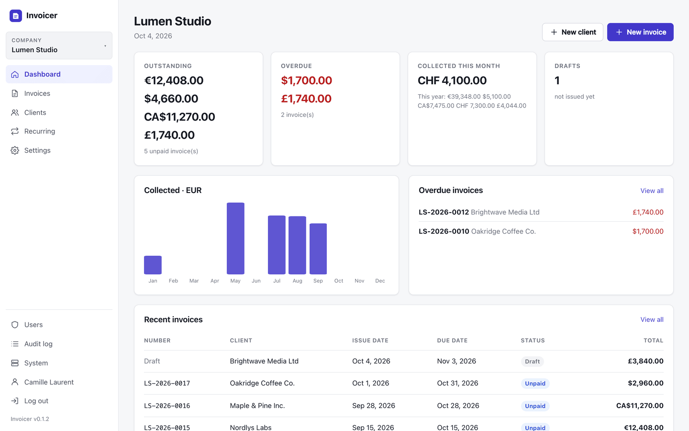
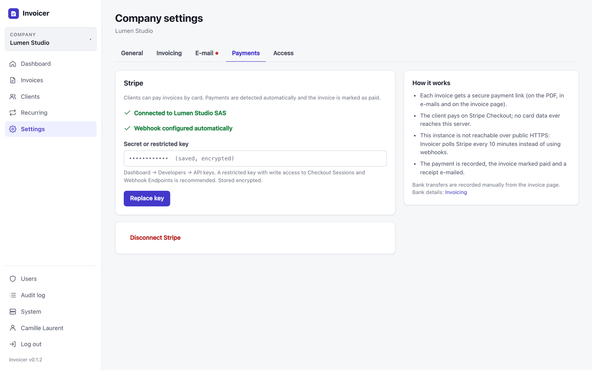

<div align="center">


# Invoicer

**Beautiful, self-hosted invoicing for freelancers and small businesses.**<br>
Multi-company · Stripe & bank transfers · Recurring invoices · EN / FR · One container, zero config.

[](https://github.com/flocom/Invoicer/releases)
[](https://github.com/flocom/Invoicer/actions/workflows/ci.yml)
[](https://github.com/flocom/Invoicer/pkgs/container/invoicer)
[](Dockerfile)
[](LICENSE.md)

[Quick start](#-quick-start) · [Features](#-features) · [Screenshots](#-screenshots) · [Security](#-security) · [Updates](#-updates)

<br>



</div>

<br>

## ✨ Why Invoicer?

- **Get paid faster.** Every invoice comes with a branded payment page: your client pays by card in two clicks (Stripe) or by bank transfer with a ready-to-scan SEPA QR code. Payments are detected automatically and a receipt goes out by itself.
- **Stop chasing clients.** Polite reminders before, on and after the due date are sent for you, in your client's language.
- **Subscriptions on autopilot.** Recurring invoices are generated, numbered and e-mailed on schedule — weekly, monthly, quarterly, yearly.
- **All your businesses, one place.** Run several companies side by side, each with its own branding, numbering, bank details, Resend and Stripe accounts.
- **Yours, really.** Runs on your server in a single ~20 MB container. No subscription, no tracking, no lock-in — your data stays in one SQLite file you can back up anywhere.

## 🚀 Quick start

```bash
docker run -d --name invoicer --restart unless-stopped \
  -p 8080:8080 -v invoicer-data:/data \
  --read-only --tmpfs /tmp --cap-drop ALL --security-opt no-new-privileges:true \
  ghcr.io/flocom/invoicer:latest
```

or with the provided [docker-compose.yml](docker-compose.yml): `docker compose up -d`

Open the site and create your account — **the first account becomes the owner** with full control. Create it right after starting the container, before sharing the address.

That's it. No `.env` to fill in: the domain is detected from your browser, and the database, encryption key and certificates are created on first start.

## 🧾 Features

<table>
<tr>
<td width="50%" valign="top">

**Invoicing**
- Multi-rate VAT and decimal quantities per line
- Sequential numbering per year (`INV-2026-0001`), immutable once issued
- Polished PDF with your logo; the brand colour is detected from the logo and darkened automatically when needed so text stays readable
- Products & services autocomplete from what you already invoiced (description, price, VAT)
- **EUR, USD, CAD, CHF, GBP**
- Drafts, partial payments, voiding, duplication

</td>
<td width="50%" valign="top">

**Getting paid**
- Public invoice page with **Pay by card** (Stripe Checkout); the PDF QR code opens it
- **Saved cards**: recurring invoices can charge the client's card automatically; a failed payment e-mails the client a link to update their card; charge any unpaid invoice from the client page with the card of your choice
- Stripe webhook set up automatically — no copy-pasting secrets
- **You are told by e-mail** (at the company's address) when a card payment goes through or an automatic charge is declined; a **Stripe log** shows every payment link, payment, charge and webhook
- Several bank accounts per company (one per currency or more); each invoice shows the account in its currency, or the one you pick, or none
- Bank transfer details + **SEPA QR code** on EUR invoices, optionally included in e-mails
- Automatic receipts, overdue tracking, dashboards

</td>
</tr>
<tr>
<td valign="top">

**Automation**
- Recurring invoices (every N weeks / months / years, end date or count)
- Reminder schedule per company (e.g. `-3, 0, 7, 15, 30` days)
- E-mails sent through **each company's own Resend account**

</td>
<td valign="top">

**Built for teams & clients abroad**
- Several companies per instance, with member access per company; copy a client to another company and see all their invoices in one place
- Address autocomplete: Swiss addresses from **swisstopo**, the rest of the world from **OpenStreetMap** or **Google Maps** (your key), queried by the server
- Owner / admin / member roles, invitations, TOTP two-factor auth
- Each client in **English or French**: PDF, e-mails and payment page follow
- English interface by default, French available per user

</td>
</tr>
</table>

## 📸 Screenshots

<table>
<tr>
<td colspan="2"><p align="center"><sub>Invoice detail — payments, public link, reminders and activity</sub></p></td>
</tr>
<tr>
<td width="62%"><p align="center"><sub>What your client sees — pay by card or bank transfer</sub></p></td>
<td width="38%"><p align="center"><sub>PDF in the client's language</sub></p></td>
</tr>
<tr>
<td><p align="center"><sub>Fast editor with live totals</sub></p></td>
<td><p align="center"><sub>Subscriptions on autopilot</sub></p></td>
</tr>
<tr>
<td><p align="center"><sub>Everything at a glance</sub></p></td>
<td><p align="center"><sub>Connect Stripe with one key</sub></p></td>
</tr>
</table>

## ⚙️ Running in production

### HTTPS

Pick one:

1. **Reverse proxy** (recommended if you already have one): Caddy, Traefik, Nginx, Cloudflare Tunnel… pointing at port `8080`. The proxy must forward the `Host` and `X-Forwarded-Proto` headers (Caddy and Traefik do it by default).
2. **Built-in Let's Encrypt**: set `TLS=auto` in `.env` and map ports `80:8080` and `443:8443`. Point your DNS at the server and open `https://your-domain`; the certificate is issued automatically for the domain you use.

Stripe webhooks are configured automatically when the instance is reachable over public HTTPS. Otherwise (local network, testing) payments are checked every 10 minutes.

### Configuration

Everything is optional — an empty `.env` works. See [.env.example](.env.example).

| Variable | Default | Purpose |
| --- | --- | --- |
| `TLS` | *(empty)* | `auto` enables built-in Let's Encrypt certificates |
| `ACME_EMAIL` | *(empty)* | Contact address for Let's Encrypt |
| `DOMAIN` | *(auto)* | Restrict built-in certificates to this host name |
| `AUTO_UPDATE` | `true` | `false` only notifies (critical/mandatory releases are still installed) |
| `TRUST_PROXY` | *(auto)* | `false` if the container is exposed directly (no proxy), `cloudflare` behind Cloudflare to honour `CF-Connecting-IP`, `true` to trust any peer. Auto = trust `X-Forwarded-*` from private networks only; always `false` with `TLS=auto` |
| `INVOICER_MASTER_KEY` | *(file)* | 32-byte base64 key to keep the encryption key out of the data volume |
| `PORT` | `8080` | Plain HTTP port inside the container |

Per-company settings (Resend, Stripe, bank details, numbering, reminders…) are managed in the web interface. Secrets are encrypted at rest.

### Setting up a company

1. **Settings → General**: legal name, address, VAT and registration numbers, logo, brand colour.
2. **Settings → Invoicing**: currency, document language, VAT rate, numbering prefix (`INV-2026-0001`, sequential per year), payment terms, legal footer, bank details, reminder schedule (e.g. `-3,0,7,15,30` days relative to the due date).
3. **Settings → E-mail**: a [Resend](https://resend.com) API key and a sender on a verified domain. Send a test.
4. **Settings → Payments**: a Stripe secret key, or better a *restricted* key with write access to *Checkout Sessions* and *Webhook Endpoints* (add *Customers*, *Payment Intents*, *Payment Methods* and read access to *Setup Intents* to use saved cards). The webhook is created for you.
5. **Settings → Access**: choose which members can see the company.

Issued invoices are immutable (numbering without gaps, buyer/seller details frozen at issue time); void and duplicate an invoice to correct it. Administrators can still delete an issued invoice after a legal warning (deleting invoices is prohibited in most countries; the deletion is recorded in the audit log).

Address autocomplete is configured in **System → Address autocomplete** (swisstopo + OpenStreetMap by default, Google Maps with a *Places API (New)* key, or off).

## 🔒 Security

- Single static Go binary on a distroless, non-root image (~20 MB), read-only root filesystem, no shell
- Argon2id password hashing (OWASP parameters, bounded concurrency so it cannot exhaust memory), optional TOTP 2FA with recovery codes
- Login throttling per client *and* account: an attacker burns only their own attempts and cannot lock the real user out; identical answers for unknown accounts
- Session tokens stored hashed, `HttpOnly`/`Secure`/`SameSite` cookies, session rotation on login
- CSRF tokens on every form plus `Origin` checks; strict Content-Security-Policy without inline scripts or styles; HSTS, `X-Frame-Options`, `nosniff`…
- API keys and 2FA secrets encrypted with AES-256-GCM, bound to their record
- Uploaded logos are decoded and re-encoded; public invoice links use 192-bit random tokens
- Stripe webhooks verified (HMAC-SHA256, timestamp tolerance) and re-fetched from the Stripe API
- Audit log of sensitive actions; the e-mail links use the recorded public URL so a forged `Host` header cannot poison them (changing it is owner-only and password-confirmed)
- Release pipeline: actions pinned by SHA, signing key confined to a `release` environment limited to `main`, Docker images signed with Sigstore cosign:
  `cosign verify ghcr.io/flocom/invoicer:latest --certificate-identity-regexp 'https://github.com/flocom/Invoicer/' --certificate-oidc-issuer https://token.actions.githubusercontent.com`

## 🔄 Updates

Every release publishes Linux binaries and a `manifest.json` signed with Ed25519. The public key is compiled into Invoicer, so an update is only installed if:

- the manifest signature is valid,
- its version is newer than the running one,
- the binary matches the signed SHA-256.

The instance checks every 6 hours (and shortly after start), takes a database backup, swaps binaries and restarts in about a second. A version that fails to start three times is skipped automatically. Releases can be flagged *critical* or set a *minimum version* to force the update everywhere.

Force it yourself:

- **System → Check now / Install now** in the interface (owner), or
- `docker exec invoicer /app/invoicer update`

Pulling a newer image (`docker compose pull && docker compose up -d`) works too.

## 💾 Backups

The whole state lives in the `/data` volume: `invoicer.db` (SQLite), `master.key` (encryption key — **back it up**, without it stored API keys cannot be decrypted), certificates and installed updates. A consistent backup is written every day to `/data/backups` (14 kept) and before each update.

```bash
docker run --rm -v invoicer-data:/data -v "$PWD":/out alpine tar czf /out/invoicer-backup.tgz -C /data .
```

## 🛠 Command line

```bash
docker exec invoicer /app/invoicer version
docker exec invoicer /app/invoicer update                       # install the latest signed release
docker exec invoicer /app/invoicer reset-password you@example.com  # one-time reset link (e.g. lost owner password)
```

## 👩‍💻 Development

```bash
INVOICER_DATA=./.devdata PORT=8090 go run ./cmd/invoicer
go test ./...
```

### Releasing

Every push to `main` publishes a new version automatically ([.github/workflows/release.yml](.github/workflows/release.yml)): the next tag is computed from the previous one (patch by default, minor for `feat:` commits, major for `BREAKING CHANGE` / `#major`), then the binaries are built, the update manifest is signed, the GitHub release is created and the Docker image is pushed. Running instances pick it up on their next update check.

Commit message keyword: `[skip release]`. Forcing an immediate install everywhere (*critical*, *minimum version*) is only possible from a manual run (*Actions → Release → Run workflow*), never from commit text.

The workflow needs the secret `RELEASE_SIGNING_KEY` in the `release` environment (restricted to `main`; add required reviewers there if you want to approve each release) (the private key matching [internal/updater/key.go](internal/updater/key.go)). To rotate keys: `go run ./cmd/release keygen`, put the new public key in `key.go`, publish that release while the secret still holds the old key, then replace the secret with the new private key for the following releases.

## 📄 License

Invoicer is **source-available** under the [PolyForm Internal Use License 1.0.0](LICENSE.md):

- ✅ free to use, self-host and modify for the internal operations of you and your company (including invoicing your own clients);
- ❌ no redistribution, resale or sublicensing, and no offering Invoicer as a service to third parties.

For any other use (reselling, hosting it for customers, white-labelling…), contact the author for a commercial license.

---

### 🇫🇷 En bref

Outil de facturation auto-hébergé, tout-en-un dans un conteneur Docker durci. Multi-entreprises (chacune avec son compte Resend et son compte Stripe), factures PDF en anglais ou en français selon le client, 5 devises, paiements par carte (Stripe) ou virement, factures récurrentes, relances automatiques, mises à jour automatiques signées depuis GitHub. Aucune variable d'environnement obligatoire : lancez le conteneur, ouvrez le site : le premier compte créé devient propriétaire (créez-le dès le démarrage).

**Licence :** [PolyForm Internal Use 1.0.0](LICENSE.md) — utilisation, auto-hébergement et modification gratuits pour vos propres besoins et ceux de votre entreprise ; revente, redistribution et offre en tant que service à des tiers interdites sans licence commerciale.
